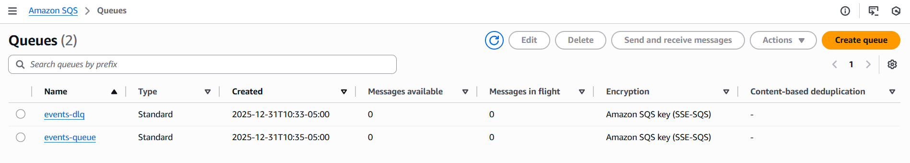
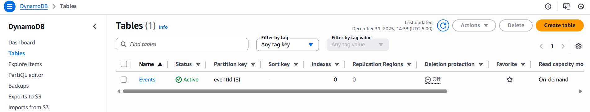
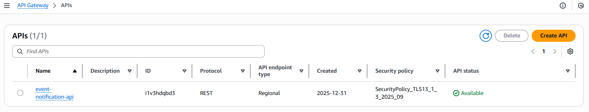
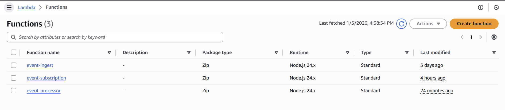
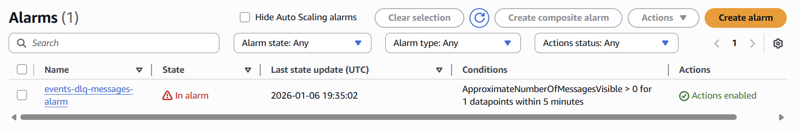

# AWS Setup Documentation

## Region

All resources created in: `us-east-2`

## IAM Resources

### event-ingest-lambda-role

Purpose: Execution role for Ingest Lambda function

**Attached Policies**:

1. `AWSLambdaBasicExecutionRole` (AWS managed)
   - Allow Lambda to create log groups and write logs to CloudWatch
2. `sqs-send-message-policy` (inline)
   - Allows Lambda to send messages to the events-queue
   - Limited to SendMessage action only

### subscription-lambda-role

Purpose: Execution role for Subscription Lambda function

**Attached Policies**:

1. `AWSLambdaBasicExecutionRole` (AWS managed)
   - Allow Lambda to create log groups and write logs to CloudWatch
2. `dynamodb-subscriptions-write` (inline)
   - Allows PutItem on Subscriptions table only
   - Cannot read, update, or delete (least privilege)

### processor-lambda-role

Purpose: Execution role for Processor Lambda function

**Attached Policies**:

1. `AWSLambdaBasicExecutionRole` (AWS managed)
   - Allow Lambda to create log groups and write logs to CloudWatch
2. `processor-lambda-policy` (inline)
   - Allows Read/Delete from SQS
   - Write to Events and Notification tables
   - Read from the Subscription table
   - Send emails via SES

### Why These Permissions?

The Ingest Lamda only need to: Write logs (for debugging) and Send events to the queue. It does not need: read from SQS, access DynamoDB, or access to SES. Follows least privilage principle.

## SQS Queues



### `events-queue` (Main Queue)

**Purpose**: To hold messages between the Ingest lambda from the Processor lambda. This prevents slow or unreliable downstream dependencies from blocking ingestion, buffers traffic spikes, and ensures messages are retried and processed asynchronously.

**URL**: https://sqs.us-east-2.amazonaws.com/026008176803/events-queue

**Configuration**:

- Type: Standard (we dont need strict ordering)
- Visibility timeout: 30 seconds
- Message retention: 4 days
- Dead-letter queue: events-dlq (3 retries)

### `events-dlq` (Deal-Letter Queue)

**Purpose**: To captures messages that fail processing after 3 times. Check this queue periodically because messages here indicate bugs or bad data.

## DynamoDB Table



## Events Table

This table is used to store incoming events data.

**Table name**: `Events`  
**Partition key**: `eventId` (String)

**Attributes**:
| Name | Type | Description |
|------|------|-------------|
| eventId | String | Primary key, UUID format (evt_xxx) |
| eventType | String | Category (deployment, alert, etc.) |
| severity | String | LOW, MEDIUM, HIGH, CRITICAL |
| title | String | Brief description |
| details | Map | Arbitrary JSON metadata |
| receivedAt | String | ISO8601, when API received it |
| processedAt | String | ISO8601, when processor handled it |
| status | String | PENDING, PROCESSED, NOTIFIED |

## Subscriptions Table

This table is used to store consumer subscription infomation.

**Table name**: `Subscriptions`  
**Partition key**: `subscriptionId` (String)  
**Global Secondary Index**: `eventType-index`

- Partition key: eventType (String)
- Purpose: Efficiently find all subscriptions for a given event type

**Attributes**:
| Name | Type | Description |
|------|------|-------------|
| subscriptionId | String | Primary key (sub_xxx format) |
| eventType | String | Event type to match (indexed via GSI) |
| severityFilter | String | LOW, MEDIUM, HIGH, CRITICAL |
| channel | String | EMAIL or WEBHOOK |
| target | String | Email address or webhook URL |
| active | Boolean | Whether subscription is active |
| createdAt | String | ISO8601 timestamp |

### Notifications Table

Audit trail of all notification attempts

**Table name**: `Notifications`  
**Partition key**: `eventId` (String)  
**Sort key**: `subscriptionId` (String)

**Attributes**:
| Name | Type | Description |
|------|------|-------------|
| eventId | String | Associated event (PK) |
| subscriptionId | String | Associated subscription (SK) |
| channel | String | EMAIL or WEBHOOK |
| target | String | Where notification was sent |
| status | String | SENT or FAILED |
| attemptedAt | String | ISO8601 timestamp |
| errorMessage | String | Error details if failed |

## API Gateway



**API Name**: `event-notification-api`  
**Type**: REST API  
**Stage**: dev  
**Invoke URL**: `https://i1v3hdqbd3.execute-api.us-east-2.amazonaws.com/dev`

### Endpoints

| Method | Path           | Lamda              | Description               |
| ------ | -------------- | ------------------ | ------------------------- |
| POST   | /events        | event-ingest       | Submit new events         |
| POST   | /subscriptions | event-subscription | Subscribe to get notified |

### API Authentication With API Keys

**Usage Plan: basic-plan**

- Rate limit: 10 requests/second
- Burst: 20 requests
- Monthly quota: 200 requests

**API Key: testing-client-key**

- Associated with basic-plan
- Required for all endpoints

### Test Script `test-api.sh`

```bash
chmod +x scripts/test-api.sh

./scripts/test-api.sh
```

## Lambda



See `lambdas` directory for code.

### event-ingest

**Purpose**: Ingest published events and send messages to SQS for Processsor Lamda to process.  
**Trigger**: API Gateway (POST /events)  
**Timeout**: 3 seconds (default)  
**Role**: event-ingest-lambda-role

### event-subscription

**Purpose**: Capture new subscriptions from consumers with eventType, severityFilter, channel (email or webhook).  
**Trigger**: API Gateway (POST /subscriptions)  
**Timeout**: 3 seconds (default)  
**Role**: subscription-lambda-role

### event-processor

**Purpose**: Process incoming messages from SQS and notify subscribers by email or webhook  
**Trigger**: SQS (events-queue)  
**Timeout**: 30 seconds  
**Role**: processor-lambda-role

## SES (Simple Email Service)

Handles sending the emails to subscribers of for event type.

**Verified Identities**: theara.projects@gmail.com (for testing as both sender and recipient)

## CloudWatch Alarms



### events-dlq-messages-alarm

Alert when messages fail processing and land in DLQ

**Metrics**: SQS -> events-dlq -> ApproximateNumberOfMessagesVisible  
**Condition**: Greater than 0  
**Action**: Send email via SNS topic (dlq-alerts)  
**Why this matters**: When message in DLQ means something is broken. This could be due to bug in Processor Lambda code or external services (SES, webhook endpoint) down. Further investigation is needed diagnose and resolve any issues.
